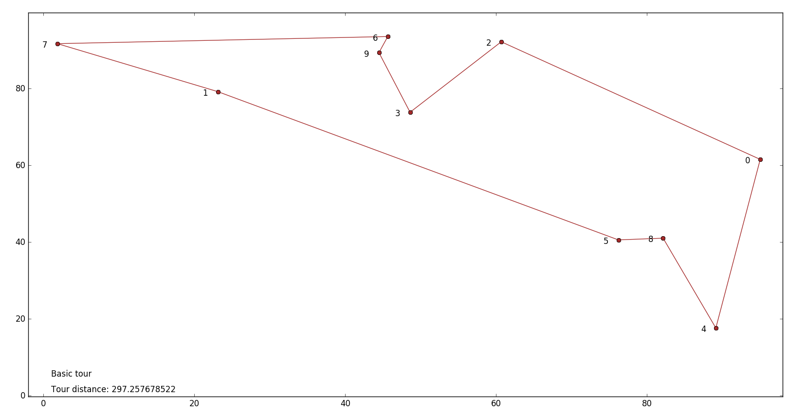
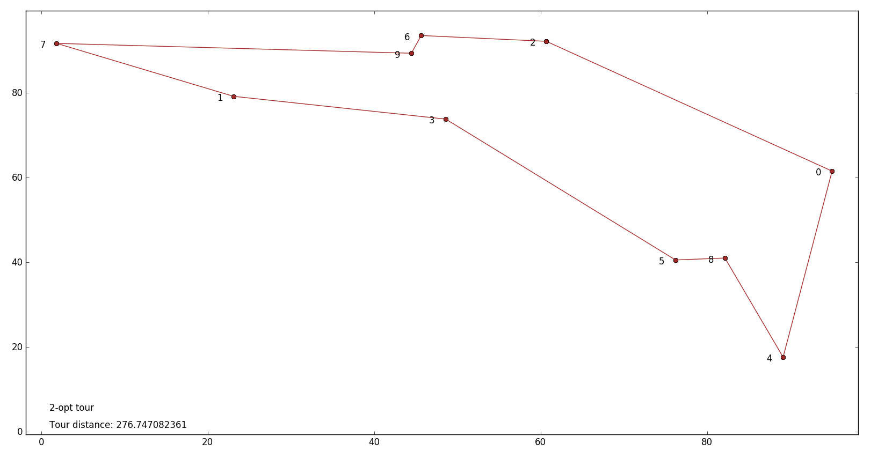

# Travelling Salesperson 2D

C++ TSP implementation that outputs a tour given a list of points.

Algorithms implemented:
* Nearest Neighbor
* Nearest Insertion
* 2-Opt

The python program plots the basic tour (result of Nearest Insertion Neighbor algorithm) and the improved tour (result of the optimization algorithm).

# Usage

Compile the C++ program:
```
g++ -Wall main.cpp -o tsp
```
Run in the same directory:
```
./tsp < ./tsp.in | python plot_tsp.py

```
* `tsp.in` : text file containing the list of point coordinates

# Example
Nearest Insertion Algorithm


Nearest Insertion Algorithm with 2-Opt

